  

  
  
  
  
  

---

# 🔐 Awesome Identity & Access Management (IAM)

> A curated directory of leading enterprise **SaaS products**, **open-source GitHub projects**, **authentication engines**, **authorization frameworks (RBAC/ABAC/ReBAC)**, and **Identity Governance & Administration (IGA)** platforms.

Whether you are building modern SaaS authentication, implementing Zero Trust architectures, enforcing fine-grained relationship-based authorization (Zanzibar), or deploying enterprise Single Sign-On (SSO) and Multi-Factor Authentication (MFA), this repository covers the top identity infrastructure solutions across commercial and self-hosted environments.

---

## 📌 Table of Contents
- [🏢 SaaS & Cloud Hosted IAM Platforms](#-saas--cloud-hosted-iam-platforms)
- [💻 Open-Source GitHub IAM Repositories](#-open-source-github-iam-repositories)
- [📊 Star History](#-star-history)
- [💖 Support & Community](#-support--community)
- [🤝 How to Contribute](#-how-to-contribute)
- [⚠️ Disclaimer](#%EF%B8%8F-disclaimer)

---

## 🏢 SaaS & Cloud Hosted IAM Platforms

**Market Size & Sector Dynamics**: The global Identity and Access Management (IAM) market is valued at **$24B – $28B in 2025–2026** and is projected to expand beyond **$60B+ by 2032** at a CAGR of ~13–15%. The market is **moderately concentrated**, led by major cloud and enterprise security giants (Microsoft, AWS, CyberArk, Okta, SailPoint) along with specialized providers focusing on Privileged Access Management (PAM), Customer Identity (CIAM), and Identity Governance.

Below is a breakdown of top commercial IAM vendors, sorted by **Company Valuation / Market Cap (Descending)**:

| 🏢 Platform | 💰 Company Valuation / Revenue | 🏷️ Starting Price | 🎁 Free Tier / Trial Limit | 🛡️ Key Capabilities & Best For |
| :--- | :--- | :--- | :--- | :--- |
| **[Microsoft Entra ID](https://www.microsoft.com/en-us/security/business/identity-access/microsoft-entra-id)** | ~$3.2 Trillion (Market Cap) | $7.00 / user / month (P1 tier) | Free forever (up to 50,000 objects / 50k MAUs for External Identities; 30-day P1/P2 trial) | Cloud identity platform — SSO, conditional access, MFA, and 10,000+ SaaS app integrations. Best for Microsoft-centric enterprise identity. |
| **[AWS IAM](https://aws.amazon.com/iam/)** | ~$2.1 Trillion (Market Cap) | $0.00 / user / month (Free with AWS) | Free forever (unlimited users and IAM Identity Center features within AWS accounts) | Fine-grained access control for AWS resources & workforce SSO across AWS accounts. Best for AWS-native identity. |
| **[CyberArk](https://www.cyberark.com/)** | ~$15.5 Billion (Market Cap) | $2.00 / user / month (Workforce SSO) | 30-day free trial (up to 100 test users / 5 privileged targets upon request) | Privileged Access Management (PAM) leader — secures privileged accounts, credentials, secrets, and session monitoring. Best for enterprise PAM. |
| **[Okta](https://www.okta.com/)** | ~$13.5 Billion (Market Cap) | $6.00 / user / month (Starter Suite, min. $1,500/yr) | 30-day free trial (up to 10 users); Developer plan free up to 7,400 active users | Independent IAM market leader — SSO, MFA, lifecycle management, and API access control. Best for enterprise identity. |
| **[SailPoint](https://www.sailpoint.com/)** | ~$6.9 Billion (Valuation) | $4.00 / user / month (Identity Security Cloud Business) | 30-day guided sandbox trial (up to 50 test identities upon sales request) | Identity Governance and Administration (IGA) leader — access certifications, role management, and compliance. Best for enterprise IGA. |
| **[Ping Identity](https://www.pingidentity.com/)** | ~$6.5 Billion (Valuation) | $3.00 / user / month (PingOne Essentials) | 30-day free trial (unlimited test users/apps during trial period) | Enterprise identity platform — SSO, MFA, and identity governance. Best for large enterprise workforce and customer identity. |
| **[BeyondTrust](https://www.beyondtrust.com/)** | ~$3.5 Billion (Valuation) | $25.00 / user / month (Privileged Remote Access) | 7-day free trial (up to 5 test endpoints/users) | Privileged Access Management — secure remote access and privilege elevation management. Best for PAM & endpoint privilege control. |
| **[JumpCloud](https://jumpcloud.com/)** | ~$2.5 Billion (Valuation) | $9.00 / user / month (Device Mgmt) / $11.00 (SSO) | 30-day free trial (unlimited features; legacy accounts free up to 10 users) | Cloud directory platform — unified directory, SSO, device management, and LDAP. Best for SMB cloud directory. |
| **[ForgeRock](https://www.forgerock.com/)** | ~$2.3 Billion (Valuation) | $3.50 / user / month (Identity Cloud entry) | 30-day developer sandbox trial (up to 100 test identities) | Enterprise identity platform — CIAM and workforce identity. Best for large-scale consumer identity (now merged with Ping Identity). |
| **[OneLogin](https://www.onelogin.com/)** | ~$500 Million (Valuation) | $2.00 / user / month (Advanced SSO) | 30-day free trial (up to 25 users) | Workforce identity — cloud directory, SSO, and MFA. Best for mid-market enterprises. |

---

## 💻 Open-Source GitHub IAM Repositories

Identity & Access Management features a thriving open-source ecosystem, spanning complete Identity Providers (IdPs), modular auth stacks, policy engines, and fine-grained authorization databases.

Below are top open-source projects sorted by **GitHub Stars_Count (Descending)**, each featuring a live Stars_Badge linking directly to the project's stargazers page:

1. ⚡ **[PocketBase](https://github.com/pocketbase/pocketbase)**   
   **Open-source backend in Go** consisting of embedded database (SQLite), real-time subscriptions, built-in identity & authentication management, and OAuth2 integration.

2. 🗝️ **[Keycloak](https://github.com/keycloak/keycloak)**   
   **The leading de facto open-source IAM platform**, Apache-2.0 licensed. Offers Single Sign-On (SSO), Multi-Factor Authentication (MFA), identity brokering, LDAP/Active Directory federation, multi-tenant realms, OAuth2, OIDC, and SAML 2.0.

3. 🛡️ **[Authelia](https://github.com/authelia/authelia)**   
   **Authentication and authorization server** providing 2FA/MFA, single sign-on (SSO), and forward-authentication for reverse proxies such as Nginx, Traefik, Caddy, and HAProxy.

4. 🚀 **[Authentik](https://github.com/goauthentik/authentik)**   
   **Flexible open-source identity provider** featuring visual flow-based authentication customization, OAuth2, OpenID Connect, SAML, LDAP server, and proxy support.

5. 📜 **[Casbin](https://github.com/casbin/casbin)**   
   **Powerful open-source authorization library** supporting access control models such as ACL, RBAC, ABAC, RESTful permissions, and policy enforcement across multiple languages (Go, Java, Node.js, Python, Rust, C++).

6. 💧 **[Ory Hydra](https://github.com/ory/hydra)**   
   **Cloud-native, OpenID Connect Certified™ and OAuth 2.0 Authorization Server** designed to secure public and internal APIs and user identity flows with high performance.

7. 🔑 **[SuperTokens](https://github.com/supertokens/supertokens-core)**   
   **Developer-first open-source Auth0 alternative** providing end-to-end user authentication, session management, social login, passwordless, and MFA with pre-built UI components.

8. 🏛️ **[Zitadel](https://github.com/zitadel/zitadel)**   
   **Cloud-native identity infrastructure** built with native multi-tenancy, FIDO2/passkeys, SCIM 2.0, audit trail logging, and API-first architecture for SaaS platforms.

9. 📱 **[Logto](https://github.com/logto-io/logto)**   
   **Modern open-source Auth0 alternative for CIAM**, offering ready-to-use sign-in UI, multi-tenancy, RBAC, machine-to-machine auth, and SDKs for modern frontend/backend stacks.

10. 🎨 **[Casdoor](https://github.com/casdoor/casdoor)**   
    **UI-first identity and access management platform** supporting OAuth2, OIDC, SAML, LDAP, CAS, web webhooks, and an administrative dashboard.

11. 🔓 **[Ory Kratos](https://github.com/ory/kratos)**   
    **Headless, API-first identity and user management system** providing registration, login, multi-factor authentication, account recovery, profile management, and custom schemas.

12. 📋 **[Open Policy Agent (OPA)](https://github.com/open-policy-agent/opa)**   
    **CNCF graduated general-purpose policy engine** enabling policy-as-code enforcement across microservices, Kubernetes clusters, CI/CD pipelines, and cloud access control.

13. 🌐 **[Dex](https://github.com/dexidp/dex)**   
    **OpenID Connect (OIDC) identity provider and federation engine**, CNCF sandbox project that delegates authentication to external providers like LDAP, SAML, GitHub, and Google.

14. 🌶️ **[SpiceDB](https://github.com/authzed/spicedb)**   
    **Open-source authorization database inspired by Google Zanzibar**, enabling fine-grained relationship-based access control (ReBAC) for high-scale applications.

15. 🔗 **[Permify](https://github.com/permify/permify)**   
    **Open-source authorization service based on Google Zanzibar**, designed to build scalable, multi-tenant relationship-based authorization systems.

16. 🌳 **[OpenFGA](https://github.com/openfga/openfga)**   
    **High-performance fine-grained authorization engine** created by Auth0/Okta, inspired by Google Zanzibar and designed for fine-grained relationship access.

17. 🦀 **[Kanidm](https://github.com/kanidm/kanidm)**   
    **Fast, secure identity management system written in Rust**, supporting native passkeys, OAuth2/OIDC, and UNIX SSH public key management.

18. 🔒 **[Pomerium](https://github.com/pomerium/pomerium)**   
    **Identity-aware access proxy** that implements Zero Trust Network Access (ZTNA) and BeyondCorp-style secure application access using your existing IdP.

19. 🧠 **[Cerbos](https://github.com/cerbos/cerbos)**   
    **Open-source, language-agnostic authorization service** that enables policy-as-code authorization for application roles, context, and dynamic policies.

20. 🏛️ **[MaxKey](https://github.com/dromara/MaxKey)**   
    **Enterprise single sign-on (SSO) and IAM platform** supporting OAuth2, OIDC, SAML 2.0, JWT, CAS, and SCIM protocol extensions with RBAC permissions.

21. 🏢 **[WSO2 Identity Server](https://github.com/wso2/product-is)**   
    **Enterprise-grade open-source IAM solution** offering SSO, MFA, identity federation, adaptive authentication, and identity governance.

22. ⚡ **[Janssen Project](https://github.com/JanssenProject/jans)**   
    **Cloud-native identity platform hosted under the Linux Foundation**, providing Auth Server (OAuth/OIDC), Agama identity orchestration, and Cedarling policy engine.

23. 🗃️ **[Apache Syncope](https://github.com/apache/syncope)**   
    **Open-source Identity Governance and Administration (IGA) system** managing digital identities across enterprise environments with BPMN 2.0 workflows.

---

## 📊 Star History

---

## 💖 Support & Community

Thank you for exploring **Awesome Identity & Access Management (IAM)**! If you find this repository valuable, please consider supporting the project:

- 🌟 **Star this repository** to increase visibility and help developers find reliable identity tools.
- 🍴 **Fork & Contribute** by adding new open-source identity projects or updating SaaS information via Pull Request.
- 📢 **Share with your team** on LinkedIn, Twitter/X, Discord, or developer forums.
- ☕ **Sponsor / Buy a Coffee**: Support ongoing open-source maintenance on the [GitHub Sponsor Dashboard](https://github.com/sponsors/ishandutta2007).

---

## 🤝 How to Contribute

We welcome community contributions! To add a new IAM solution, authorization framework, or cloud directory platform:

1. Fork this repository.
2. Edit `README.md` to add your entry in alphabetical order or sorted by relevant metrics.
3. Ensure your submission includes clear documentation, valid links, and factual descriptions.
4. Submit a Pull Request targeting the `main` branch.

Check out our full curated list of awesome lists at [Awesome Awesome Awesome](https://github.com/ishandutta2007/Awesome-Awesome-Awesome).

---

## ⚠️ Disclaimer

- This list is **community-curated** for informational and educational purposes only.
- Identity and access management systems control critical infrastructure. Always verify compliance (GDPR, CCPA, SOC 2, HIPAA) and perform proper security audits before deploying self-hosted or SaaS identity solutions in production.
- All product names, logos, and brands are property of their respective owners.

---

  <b>Made with ❤️ for Security Engineers, Identity Architects &amp; Developers worldwide.</b>

